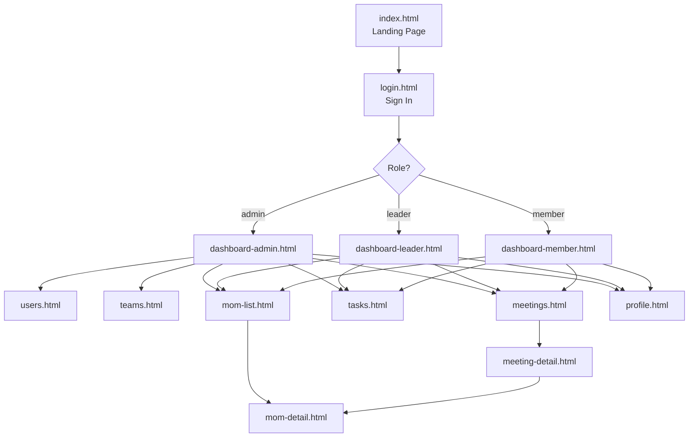

# TeamSync — User Flow Analysis

> Maps every page by role, identifies broken flows, redundant screens, missing pages, and recommended changes.

---

## Global Flow Overview



---

## Role-by-Role Flow

---

### 👤 Unauthenticated User

| Step | Page | Purpose | Status |
|---|---|---|---|
| 1 | `index.html` | Brand + features overview | ✅ Needed |
| 2 | `login.html` | Authentication | ✅ Needed |
| — | *(redirect on auth)* | Redirect to role dashboard | ✅ Working |

**Issues:**
- `index.html` redirects logged-in users to their dashboard — ✅ correct behaviour
- `login.html` does the same — ✅ correct

---

### 🛡️ Admin Flow

**Entry:** `dashboard-admin.html`

```
dashboard-admin
    ├── users.html          (User Management)
    ├── teams.html          (Teams)
    ├── meetings.html
    │       └── meeting-detail.html
    │               └── mom-detail.html
    ├── mom-list.html
    │       └── mom-detail.html
    ├── tasks.html
    └── profile.html
```

| Page | Role Access | Purpose | Keep? |
|---|---|---|---|
| `dashboard-admin.html` | Admin only | System overview + activity feed | ✅ Keep |
| `users.html` | Admin only | Manage all users | ✅ Keep |
| `teams.html` | Admin only | Manage all teams | ✅ Keep |
| `meetings.html` | All roles | List/filter all meetings | ✅ Keep |
| `meeting-detail.html` | All roles | Meeting overview + tasks + transcript | ✅ Keep |
| `mom-list.html` | All roles | Browse all MOMs | ✅ Keep |
| `mom-detail.html` | All roles | Read individual MOM | ✅ Keep |
| `tasks.html` | All roles | Task list + filtering | ✅ Keep |
| `profile.html` | All roles | Account settings | ✅ Keep |

**Admin-specific missing pages:**
- ❌ No **Analytics/Reports page** — the admin dashboard shows stats but there's no drill-down. The "System Health" section has progress bars but nowhere to go.
- ❌ No **Single User Detail page** — `users.html` has Edit buttons that link to `users.html` itself (circular). Clicking Edit should go to a user detail/edit screen.
- ❌ No **Single Team Detail page** — `teams.html` cards have no clickable destination.

---

### 👥 Team Leader Flow

**Entry:** `dashboard-leader.html`

```
dashboard-leader
    ├── meetings.html
    │       └── meeting-detail.html
    │               └── mom-detail.html
    ├── mom-list.html
    │       └── mom-detail.html
    ├── tasks.html
    └── profile.html
```

| Page | Role Access | Purpose | Keep? |
|---|---|---|---|
| `dashboard-leader.html` | Leader only | Team pulse + tabbed metrics | ✅ Keep |
| `meetings.html` | All roles | List meetings | ✅ Keep |
| `tasks.html` | All roles | Task management | ✅ Keep |
| `mom-list.html` | All roles | Browse MOMs | ✅ Keep |
| `profile.html` | All roles | Account settings | ✅ Keep |

**Leader-specific missing pages:**
- ❌ No **"My Team" detail page** — leaders see their team's tasks/progress but there's no dedicated team view showing member roster, individual workloads, and contact info. Currently that data is only accessible to Admins through `teams.html`.
- ❌ No **"Schedule Meeting" modal/page** — the "+ Schedule Meeting" button on `dashboard-leader.html` and `meetings.html` does nothing. Either a modal or a new page is needed.

---

### 🧑 Member Flow

**Entry:** `dashboard-member.html`

```
dashboard-member
    ├── meetings.html
    │       └── meeting-detail.html
    │               └── mom-detail.html
    ├── mom-list.html
    │       └── mom-detail.html
    ├── tasks.html
    └── profile.html
```

| Page | Role Access | Purpose | Keep? |
|---|---|---|---|
| `dashboard-member.html` | Member only | Personal schedule, tasks, MOMs | ✅ Keep |
| `meetings.html` | All roles | List meetings | ✅ Keep |
| `tasks.html` | All roles | Task list | ✅ Keep |
| `mom-list.html` | All roles | Browse MOMs | ✅ Keep |
| `profile.html` | All roles | Account settings | ✅ Keep |

**Member-specific missing pages:**
- ❌ No **notification center** — members are the primary recipients of task assignments and MOM shares, yet there's no way to view a notification history beyond the topnav bell icon (which is decorative).

---

## Pages to Remove / Consolidate

### ❌ `index.html` — Consider removing for internal tools
The landing page is a public-facing marketing page. For an internal team tool, users would bookmark the login URL directly. The page is presentable but adds a step. **If this is a demo/portfolio app, keep it. If it were a real internal tool, redirect root to login directly.**

> **Verdict: Keep for demo purposes, but mark it as demo-only.**

---

### ⚠️ `dashboard-leader.html` — "Progress Metrics" tab is redundant

The leader dashboard has two tabs: **Overview** and **Progress Metrics**. The Progress Metrics tab contains:
- Sprint Velocity, Open Tasks, Hours in Meetings, MOMs Published stats
- Team Breakdown progress bars
- Status Distribution breakdown

All of this data is either already visible in the Overview tab or could be on a dedicated analytics page. Having a tab within the dashboard adds complexity without adding a distinct destination. 

> **Verdict: Collapse the tab, move the 4 stat cards into the Overview header row, and remove the tab UI entirely.**

---

## Pages to Add

### ➕ 1. `schedule-meeting.html` (or modal) — HIGH PRIORITY
**Triggers:** "+ Schedule Meeting" button on `meetings.html` and `dashboard-leader.html`  
**Fields needed:** Title, Date/Time, Duration, Participants (multi-select), Location, Agenda notes  
**Who needs it:** Admin, Leader  
**Why:** The most common action in the app has no screen.

---

### ➕ 2. `user-detail.html` — MEDIUM PRIORITY
**Triggers:** "Edit" links in `users.html` and `dashboard-admin.html` team directory  
**Currently:** Both link back to `users.html` (the list page) — circular  
**Content needed:** User info form, role change, team assignment, activity history, status toggle  
**Who needs it:** Admin only  

---

### ➕ 3. `team-detail.html` — MEDIUM PRIORITY
**Triggers:** Team cards in `teams.html`  
**Currently:** Team cards have no click destination — the `more_vert` overflow menu appears on hover but does nothing  
**Content needed:** Team roster, sprint overview, task board, meeting history for that team  
**Who needs it:** Admin (full view), Leader (their team only)  

---

### ➕ 4. Notification Center — LOW-MEDIUM PRIORITY
**Triggers:** Bell icon in the top navigation bar (currently decorative)  
**Content needed:** List of recent notifications (task assigned, meeting added, MOM shared), mark-as-read  
**Who needs it:** All roles, especially Member  

---

### ➕ 5. `create-mom.html` (or modal) — LOW PRIORITY
**Triggers:** FAB button on `mom-list.html`, "Upload MOM" button on `meeting-detail.html`  
**Currently:** Both buttons do nothing  
**Content needed:** Link to meeting, upload PDF/doc, add participants, key decisions, action items  
**Who needs it:** Admin, Leader  

---

## Full Page Inventory — Keep / Remove / Add

| Page | Status | Action |
|---|---|---|
| `index.html` | Exists | ✅ Keep (demo showcase) |
| `login.html` | Exists | ✅ Keep |
| `dashboard-admin.html` | Exists | ✅ Keep |
| `dashboard-leader.html` | Exists | ⚠️ Keep + remove Progress Metrics tab |
| `dashboard-member.html` | Exists | ✅ Keep |
| `users.html` | Exists | ✅ Keep |
| `teams.html` | Exists | ✅ Keep |
| `meetings.html` | Exists | ✅ Keep + wire up "Schedule Meeting" button |
| `meeting-detail.html` | Exists | ✅ Keep |
| `tasks.html` | Exists | ✅ Keep |
| `mom-list.html` | Exists | ✅ Keep + remove duplicate FAB/card |
| `mom-detail.html` | Exists | ✅ Keep + add back button |
| `profile.html` | Exists | ✅ Keep + remove "Share Profile" |
| `schedule-meeting.html` | **Missing** | ➕ Add (or as modal) |
| `user-detail.html` | **Missing** | ➕ Add (Admin only) |
| `team-detail.html` | **Missing** | ➕ Add (Admin + Leader) |
| Notification center | **Missing** | ➕ Add (all roles) |
| `create-mom.html` | **Missing** | ➕ Add (or as modal) |

---

## Dead Ends (Pages with No Forward Navigation)

| Page | Dead End Issue |
|---|---|
| `mom-detail.html` | No back button — requires browser back |
| `profile.html` | "Save Changes" button has no confirmation route; "Share Profile" goes nowhere |
| `users.html` | "Edit" links are self-links (circular) |
| `teams.html` | Team cards have no destination |
| `meeting-detail.html` | "Preview" MOM button does nothing |
| `meetings.html` | Pagination buttons do nothing; insight cards "Meeting Pulse" and "Schedule Assistant" go nowhere |
| `mom-list.html` | FAB "+" button does nothing |
| `tasks.html` | "New Task" button does nothing; pagination doesn't advance |
| `dashboard-leader.html` | "+ Schedule Meeting" and "+ Assign Task" buttons are dead |

---

## Flow Additions Summary (Priority Order)

```
Priority 1 — Fixes broken flows:
  • Wire up "Schedule Meeting" → either modal or new page
  • Fix "Edit" in users.html → user-detail.html
  • Add back button to mom-detail.html

Priority 2 — Fills missing destinations:
  • team-detail.html → clicking a team card should go somewhere
  • Create MOM flow → FAB + Upload MOM button need a target

Priority 3 — Improves role completeness:
  • Leader: "My Team" view (subset of team-detail)
  • Member: Notification center
  • Admin: Analytics drill-down page
```
